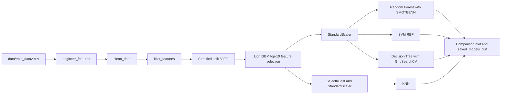

# ML Project: Steam Games Analysis & Prediction

A robust Machine Learning pipeline for Steam games analysis, featuring advanced feature engineering, model tuning, and evaluation fo Regression and Classification tasks.

---

## Architecture

```text
ml_project/
├── config.py             # Paths, seeds, target names, domain constants
├── preprocessing.py      # clean_data(), engineer_features(), split_features_target(), save_artifacts()
├── feature_selection.py  # filter_features(), lgbm_feature_selection()
├── plots.py              # Plots + print_header()
├── regression.py         # Regression pipeline (entry point)
├── classification.py     # Classification pipeline (entry point)
├── data/                 # train_data.csv (regression), train_data2.csv (classification)
├── saved_models/         # Regression artefacts   (generated)
└── saved_models_cls/     # Classification artefacts (generated)
```

| Module | Responsibility | Depends on |
|---|---|---|
| `config.py` | Single source of truth for settings and column lists | – |
| `plots.py` | Visualisation and console headers | – |
| `preprocessing.py` | Cleaning, feature engineering, X/y split, artefact saving | `config`, `plots` |
| `feature_selection.py` | Variance/correlation filtering and LightGBM importance ranking | `config`, `plots` |
| `regression.py` | Tuning, stacking, evaluation for the regression task | all of the above |
| `classification.py` | Training and comparison of four classifiers | all of the above |

### Shared preprocessing API

| Function | Purpose |
|---|---|
| `engineer_features(df, show_plots=True)` | Full feature-engineering chain (see below) |
| `clean_data(df, medians=None, modes=None)` | Median/mode imputation. Fits on `df` when no values are given; reuses saved values for new data. Returns `(df, medians, modes)` |
| `filter_features(df, target_col)` | Drops near-constant columns (top value ≥ 99.5% of rows) and one of each highly correlated pair ($\vert{}r\vert{} > 0.85$) |
| `lgbm_feature_selection(X, y, task)` | Ranks features by LightGBM gain; returns the top 10 |

### Feature engineering stages (`engineer_features`)

| # | Stage | Examples |
|---|---|---|
| 1 | Counts, tiers, pricing | `Marketing_Tier`, `Price_Tier`, `Discount_Percentage`, `Platform_Reach` |
| 2 | Text, languages, dates, hardware | Review sentiment, `NumLanguages`, `GameAge`, `Release_Quarter`, parsed RAM/CPU/OpenGL |
| 3 | Popularity statistics | Log transforms, `relative_variation_*`, `Owners_to_Players_Ratio` |
| 4 | Interaction features | `Value_for_Money`, `Revenue_Proxy`, `Game_Momentum` |
| – | Cleanup | Raw ID and free-text columns dropped |

---

## Pipelines

### Regression: `RecommendationCount`

```mermaid
flowchart LR
    A["data/train_data.csv"] --> B["engineer_features"]
    B --> C["filter_features"]
    C --> D["clean_data"]
    D --> E["Train / test split 80/20"]
    E --> F["LightGBM top-10 feature selection"]
    F --> G["StandardScaler"]
    G --> H["Optuna: XGBoost and LightGBM"]
    H --> I["Stacking with Ridge meta-model"]
    I --> J["Evaluation"]
    J --> K["saved_models/"]
```



| Step | Detail |
|---|---|
| Target | `log1p(RecommendationCount)` |
| Tuning | Optuna TPE, 15 trials per model, objective = 5-fold CV R² |
| Model | `StackingRegressor` (XGBoost + LightGBM → Ridge) |
| Metrics | R² on log scale; RMSE and MAE after `expm1`; 5-fold CV R² |

#### 📊 Regression Results & Performance Summary
The regression models were evaluated to predict the recommendation count. Before stacking, individual model performance was:
* **LightGBM $R^2$:** 0.8006[cite: 9]
* **XGBoost $R^2$:** 0.7995[cite: 9]

The **Final Stacking Model** achieved the following performance metrics:
* **Test $R^2$ Score:** 0.8005[cite: 8]
* **$R^2$ CV Mean:** 0.8029 (Std: 0.0077)[cite: 8]
* **RMSE:** 3893.30[cite: 8]
* **MAE:** 556.85[cite: 8]

**Key Data Insights:**
* **Feature Importance:** Based on the LightGBM gain analysis, `SteamSpyOwners` is the most dominant predictor, followed by `relative_variation_players` and `Owners_to_Players_Ratio`[cite: 7].
* **Correlations:** The target variable `RecommendationCount` shows a moderate positive correlation with `Quality_Visibility` (0.47) and `Metacritic` (0.47)[cite: 5, 6].

---

### Classification: `GamePopularity`



| Model | Setup |
|---|---|
| **Random Forest** | SMOTEENN resampling; sweeps `n_estimators` then `max_depth` |
| **SVM** | RBF kernel, `C=10`, `gamma='scale'`, balanced class weights |
| **Decision Tree** | `GridSearchCV` (5-fold) over criterion, depth, split/leaf sizes, max features |
| **KNN** | Sweeps `k` and weighting (`uniform`, `distance`, inverse-square) |

#### 📊 Classification Results & Performance Summary
The classification models were trained and evaluated on the test set, yielding the performance metrics comparison shown below (`classifier_summary.png`):

| Model | Accuracy (%) | Training Time (s) | Test Time (s) |
|---|---|---|---|
| **Decision Tree** | **89.83%** | 5.54s | **0.0005s** |
| **KNN** | 89.30% | **0.02s** | 0.1302s |
| **Random Forest** | 86.36% | 0.35s | 0.0170s |
| **SVM** | 85.04% | 0.83s | 0.3549s |

* **Best Accuracy:** **Decision Tree** achieved the highest classification accuracy at **89.83%** with an exceptional inference speed of **0.0005s**.
* **Fastest Training Time:** **KNN** completed its training phase the fastest in just **0.02 seconds**.

---

### Saved artefacts

| Folder | Files |
|---|---|
| `saved_models/` | `selected_features`, `scaler`, `stacking_model`, `xgb_model`, `lgb_model`, `train_medians`, `train_modes` |
| `saved_models_cls/` | `cls_selected_features`, `cls_scaler`, `cls_train_medians`, `cls_train_modes`, `rf_model`, `svm_model`, `dt_model`, `knn_selector`, `knn_selected_features`, `knn_scaler`, `knn_best_params`, `knn_model` |

All files are `.pkl`. To score new data: `engineer_features` → `clean_data(df, medians, modes)` with the saved values → select the saved features → apply the saved scaler → predict.

---

## Usage

```bash
pip install pandas numpy scikit-learn lightgbm xgboost optuna imbalanced-learn matplotlib seaborn

python regression.py        # trains and saves to saved_models/
python classification.py    # trains and saves to saved_models_cls/
```
